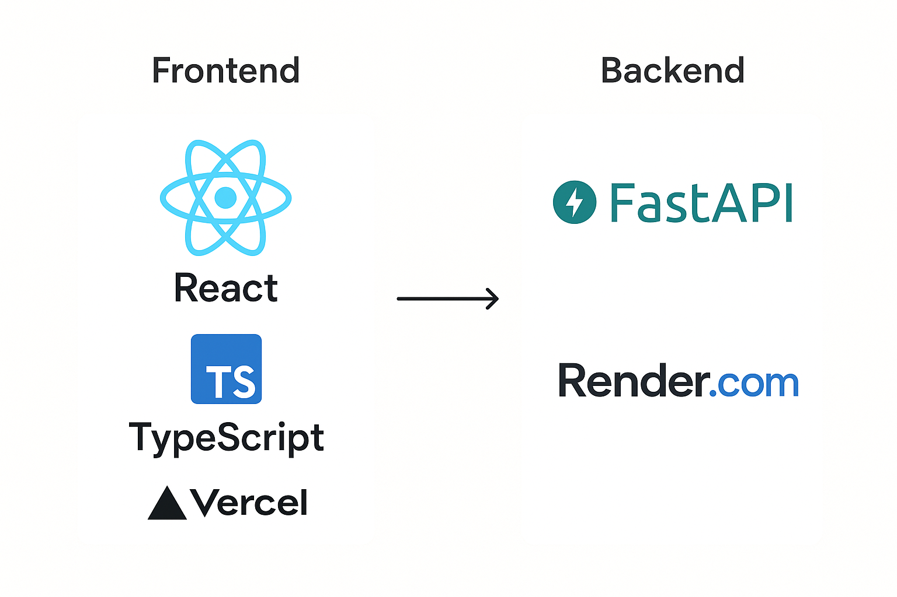

# 🔄 単位変換アプリ（ConvertPro）

様々な単位を簡単に変換できるWebアプリケーション。
直感的なUIと豊富な変換カテゴリを提供します。

## 📱 アプリ画面
### メイン画面


### 変換モーダル


## ✨ 機能

### 📏 単位変換カテゴリ（12種類）
- **距離**: m, km, cm, mm, ft, inch
- **データサイズ**: B, KB, MB, GB, TB
- **重量**: g, kg, lb, oz
- **時間**: s, min, h, day
- **温度**: °C, °F, K
- **面積**: m², km², cm², ft²
- **体積**: L, mL, m³, gal
- **速度**: m/s, km/h, mph, ft/s
- **圧力**: Pa, kPa, bar, psi
- **エネルギー**: J, kJ, cal, kWh
- **角度**: 度, ラジアン, グラード
- **燃費**: km/L, L/100km, mpg

### 🔧 主要機能
- リアルタイム単位変換
- 変換履歴の保存・表示
- 単位の相互変換（スワップ機能）
- レスポンシブデザイン
- 直感的なモーダルUI

## 🛠️ 技術スタック

### フロントエンド
- **React 19.1.0** - UIライブラリ
- **TypeScript** - 型安全性
- **Tailwind CSS** - スタイリング
- **Vite** - ビルドツール

### バックエンド
- **FastAPI** - PythonのWebフレームワーク
- **SQLAlchemy** - ORM
- **SQLite** - データベース
- **Pydantic** - データバリデーション
- **Uvicorn** - ASGIサーバー

### その他
- **CORS** - クロスオリジン対応
- **REST API** - API設計

## 🚀 セットアップ

### 前提条件
- Node.js (v18以上)
- Python (v3.10以上)
- pip

### バックエンドのセットアップ
```bash
# リポジトリをクローン
git clone https://github.com/Hikkun098/unit-converter.git
cd unit-converter

# バックエンドディレクトリに移動
cd backend

# 仮想環境作成
python -m venv venv
source venv/bin/activate  # Windows: venv\Scripts\activate

# 依存関係インストール
pip install fastapi uvicorn sqlalchemy

# サーバー起動
uvicorn app.main:app --reload
```

### フロントエンドのセットアップ
```bash
# フロントエンドディレクトリに移動
cd frontend

# 依存関係インストール
npm install

# 開発サーバー起動
npm start
```

### アクセス
- フロントエンド: http://localhost:3000
- バックエンドAPI: http://localhost:8000
- API仕様書: http://localhost:8000/docs


## 🏗️ アーキテクチャ構成
React + TypeScript → Vercel (フロントエンド)
FastAPI Backend → Railway (バックエンド)
Vercel ↔ Railway (API連携)

## 🏗️ アーキテクチャ



## 📁 プロジェクト構造

```
unit-converter/
├── backend/
│   ├── app/
│   │   ├── main.py              # FastAPIメインアプリ
│   │   ├── database.py          # データベース設定
│   │   ├── models.py            # データモデル
│   │   └── data/
│   │       └── unit_data.py     # 変換係数データ
│   └── requirements.txt         # Python依存関係
├── frontend/
│ ├── src/
│ │ ├── components/ # Reactコンポーネント
│ │ │ ├── Header.tsx
│ │ │ ├── Footer.tsx
│ │ │ ├── CategoryCard.tsx
│ │ │ ├── ConversionModal.tsx
│ │ │ └── ConversionHistory.tsx
│ │ ├── hooks/
│ │ │ └── useConversion.tsx
│ │ ├── data/
│ │ │ └── unitData.ts
│ │ ├── services/
│ │ │ └── api.ts # API呼び出し
│ │ ├── types/
│ │ │ └── index.tsx
│ │ ├── App.css
│ │ ├── App.test.tsx
│ │ ├── App.tsx # メインコンポーネント
│ │ ├── index.css
│ │ └── index.tsx
│ ├── package.json
│ └── tailwind.config.js
├── LICENSE
└── README.md
```

## 🌐 API エンドポイント

### 変換API
```http
POST /api/convert
Content-Type: application/json

{
  "value": 1000,
  "from_unit": "m",
  "to_unit": "km",
  "category": "distance"
}
```

### カテゴリ一覧
```http
GET /api/categories
```

### 履歴機能
```http
GET /api/history     # 履歴取得
POST /api/history    # 履歴保存
```


## 🔮 今後の改善予定

### 機能追加
- [ ] 変換履歴への即時反映（現在の課題）
- [ ] セッション別履歴管理
- [ ] 変換履歴へのメモ機能
- [ ] 単位変換のカテゴリをより充実させる
- [ ] 変換結果のコピー機能
- [ ] お気に入り変換の保存機能
- [ ] 検索機能（単位名から検索）

### UI/UX改善
- [ ] ダークモード対応
- [ ] レスポンシブUIの改善
- [ ] カテゴリ追加時UI/UX改善
- [ ] PWA対応

### 技術的改善
- [ ] CI/CDパイプライン構築
- [ ] テストコードを実行し開発効率・品質の向上を図る
- [ ] パフォーマンス最適化


## 🤝 開発者

**Murakami Hidehiro** - 個人開発

## 📄 ライセンス

このプロジェクトはMITライセンスの下で公開されています。